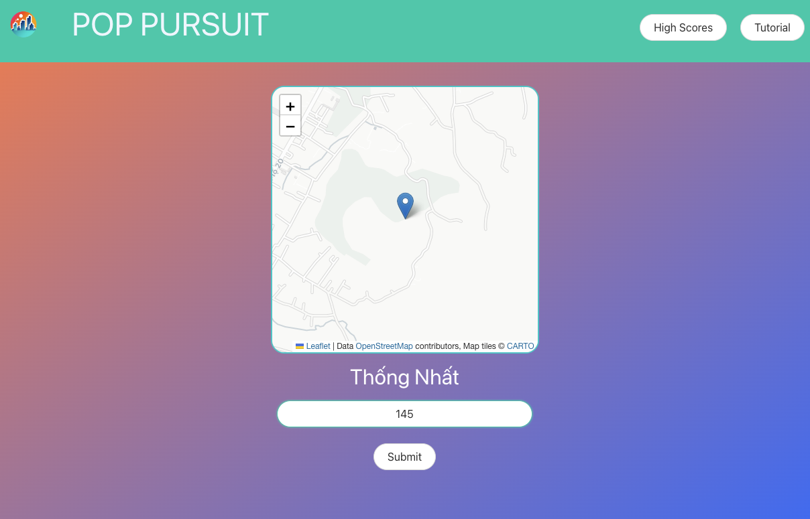

# Pop Pursuit

## Overview
This webapp challenges users to guess the population of a random city from anywhere in the world. The user is given a score based on how close their guess is to the actual population. Top scores are saved in localStorage so users can see their progress and play as many times as they want.

## How to Play
To play, simply load the page. Note the name of the city, examine the map to see where the city is located, and take a guess at its population. The closer your guess is to the actual population, the better (lower) your score will be.

## Technologies Used
- HTML
- CSS
- JavaScript
- Bulma
- jQuery
- Day.js
- Leaflet
- GeoDB API
- OpenWeatherMap API

